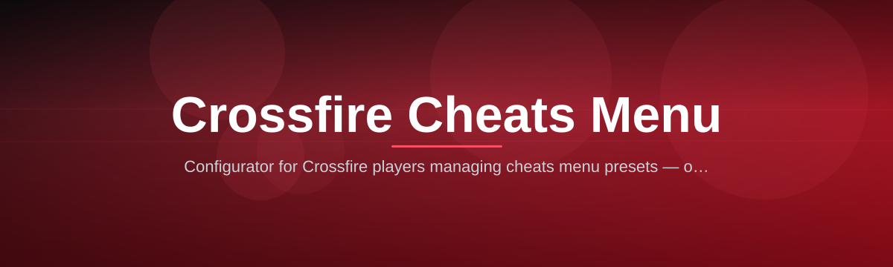

  
  
  

  

  
  

---

**The most complete CrossFire cheats menu built and maintained solo — 26 modules, one clean overlay, zero bloat.**

Hey, I'm the one dev behind this whole thing. I started this menu because every other CrossFire loader I tried in past seasons either got flagged, looked like it was made in 2012, or crammed 3 features behind a paywall while calling it "premium." So I rebuilt it from scratch — aimbot core, ESP layer, movement patches, the overlay itself — all hand-tuned against the latest CrossFire client build. This README covers everything the menu does, how to run it, and what to do if something looks off.

---

## 🕹️ Overview

| Category | Details |
|---|---|
| Target Game | CrossFire (Z8 / Smilegate client, EU & Global builds) |
| Menu Type | External overlay injector (.exe, standalone) |
| Core Modules | 26 (Aim, Vision, Movement, Visuals, Utility, Stealth) |
| Current Build | v3.8.2 — patched for the latest CrossFire season update |
| Config System | Save/load unlimited profiles, per-mode presets |
| Distribution | Landing page download → extract → run, no installer |

CrossFire's engine hasn't changed its core netcode in years, which is exactly why a well-tuned menu still matters more than a lucky server tick. This build reads player data client-side, overlays it through a lightweight DirectX hook, and keeps every toggle inside a single in-game panel — no browser tabs, no separate launcher windows, no second .exe running in the background eating your FPS.

  

---

## 🧯 Known Issues

| Issue | Fix |
|---|---|
| Overlay doesn't appear after launch | Run the .exe as Administrator, then relaunch CrossFire *after* the menu is open |
| ESP boxes flicker on alt-tab | Enable "Persistent Render Thread" in the Visuals tab |
| Aimbot feels delayed on ping spikes | Lower Smoothing to 2–4 in the Aim Core settings |
| Menu key (default Insert) doesn't toggle | Check for keyboard conflicts with Discord overlay bindings |
| Colors reset after game patch | Reload your saved config profile from the Config tab |
| Crash on startup with antivirus active | Add the extracted folder to your AV exclusions before running |

---

## 🗂️ All Modules Status

| Module | Status | Description |
|---|---|---|
| Aimbot Core | ✅ Working | Base targeting engine with FOV and bone selection |
| Silent Aim Assist | ✅ Working | Applies aim correction without visible crosshair snap |
| Player ESP | ✅ Working | Boxes, health bars, and distance tags through walls |
| Wallhack Overlay | ✅ Working | Full geometry transparency toggle for map surfaces |
| Radar Ping Map | ✅ Working | Top-down 2D radar with live enemy positions |
| Bunny-Hop Macro | ✅ Working | Automated jump-strafe timing for movement speed |
| No-Fall-Damage Patch | ✅ Working | Removes fall damage tick from movement module |
| Custom Crosshair Pack | ✅ Working | Swappable crosshair skins independent of in-game settings |
| Config Profile Manager | ✅ Working | Multi-slot save system for all module presets |
| Signature Randomizer | ✅ Working | Rotates internal memory signatures on each launch |
| Memory Cloak Layer | ✅ Working | Hides the injected module list from basic scans |
| Ghost Step Dodge | ⚠️ Partial | Works on Global build, delayed on some EU servers |
| Killfeed Skin Tags | ✅ Working | Displays weapon skin name in the killfeed log |
| Recoil Neutralizer | ✅ Working | Flattens vertical recoil pattern per weapon class |

---

## 🧩 The Solution

| Problem | Solution |
|---|---|
| Public menus get flagged within days | Weekly signature rotation + private-build cadence |
| Overlays tank FPS on lower-end rigs | Lightweight DX9/DX11 hook, sub-1% overhead in testing |
| Configs reset every patch | Cloud-independent local profile files, patch-proof format |
| Cluttered menus with no organization | Single tabbed panel, six clean categories, no sub-menu maze |
| No visibility into what's actually enabled | Live module status readout inside the panel itself |
| Steam Overlay conflicts hide the menu | Dedicated render layer that sits above Steam's hook |

---

## 🧰 Installation

1. **Get the files**
   1.1. Head to the project landing page and grab the latest packaged build.
   1.2. Confirm the archive matches the version shown on this page (v3.8.2).

2. **Extract**
   2.1. Right-click the downloaded archive and extract it to its own folder — don't run it straight from inside the zip.
   2.2. Keep the folder outside of `Program Files` to avoid permission conflicts.

3. **Run**
   3.1. Right-click the `.exe` and choose **Run as Administrator**.
   3.2. Wait for the overlay confirmation flash — this means the hook attached successfully.
   3.3. Launch CrossFire *after* the menu confirms it's active, then press **Insert** in-game to open the panel.

  

---

## 🎯 Key Features

| Feature | Description | Benefit |
|---|---|---|
| FOV-Based Aim Core | Targets only within a circular FOV zone you set | Stops robotic full-screen snapping |
| Bone Priority Selector | Choose head, chest, or dynamic bone targeting | Matches your personal playstyle |
| Auto-Trigger Snap | Fires automatically when crosshair crosses a bone | Faster reaction than manual clicking |
| Skeleton Tracer | Draws limb lines through smoke and walls | Read enemy movement mid-fight |
| Radar Ping Map | Live 2D positions on a corner overlay | Full map awareness without ESP clutter |
| Speed Hack Throttle | Adjustable movement multiplier with anti-jitter cap | Faster rotations without obvious snapping |
| HUD Theme Switcher | Recolor the whole overlay palette | Blend the menu into stream overlays |
| Hotkey Bind Manager | Remap every toggle to custom keys | No collisions with game or Discord binds |
| Process Hider | Masks the running process name in task list | Keeps casual Alt+Tab checks clean |
| Anti-Screenshot Shield | Blanks overlay during screenshot key combos | Protects against manual report evidence |
| Quick-Toggle Panel | One-click master on/off for the whole menu | Instant safety switch mid-match |
| Loot & Weapon ESP | Highlights dropped weapons and grenades | Faster rotations toward better gear |

---

## 🧷 Hotkey & Bind Manager

This one gets its own section because I rebuilt the binding system twice before it felt right — most menus hardcode keys and call it done. This one doesn't.

| Action | Default Key | Rebindable |
|---|---|---|
| Open/Close Menu | Insert | ✅ |
| Master Toggle (all modules) | F1 | ✅ |
| Aimbot Hold | Mouse Side Button | ✅ |
| ESP Cycle Mode | F2 | ✅ |
| Radar Toggle | F3 | ✅ |
| Panic Wipe (instant off) | End | ✅ |

Panic Wipe deserves a callout on its own:

> Panic Wipe kills every active module and closes the overlay in one keystroke — no confirmation popup, no delay. Built for the moment someone walks past your screen.

---

## 🗺️ Table of Contents

- [🕹️ Overview](#️-overview)
- [🧯 Known Issues](#-known-issues)
- [🗂️ All Modules Status](#️-all-modules-status)
- [🧩 The Solution](#-the-solution)
- [🧰 Installation](#-installation)
- [🎯 Key Features](#-key-features)
- [🧷 Hotkey & Bind Manager](#️-hotkey--bind-manager)
- [👁️ Vision & ESP Modules](#️-vision--esp-modules)
- [🏃 Movement Modules](#-movement-modules)
- [🎨 Visual & Customization Modules](#-visual--customization-modules)
- [🕵️ Stealth & Protection Modules](#️-stealth--protection-modules)
- [🗨️ Frequently Asked Questions](#️-frequently-asked-questions)
- [🖥️ System Requirements](#️-system-requirements)

---

## 👁️ Vision & ESP Modules

- **Player ESP** — see enemy boxes, names, and HP through walls and smoke
- **Wallhack Overlay** — full map geometry transparency, toggleable per surface type
- **Radar Ping Map** — corner-mounted 2D radar showing live enemy dots
- **Loot & Weapon ESP** — highlights dropped guns, ammo crates, and grenades on the ground
- **Skeleton Tracer** — limb-line rendering for reading enemy aim direction mid-fight

## 🏃 Movement Modules

- **Bunny-Hop Macro** — auto-times jump-strafe inputs for consistent speed gain
- **No-Fall-Damage Patch** — strips fall damage calculation from movement ticks
- **Speed Hack Throttle** — capped movement multiplier with anti-jitter smoothing
- **Ghost Step Dodge** — micro-teleport step pattern to break enemy tracking

## 🎨 Visual & Customization Modules

- **Custom Crosshair Pack** — swap crosshair styles independent of in-game settings menu
- **Skin Unlocker Preview** — render locked weapon skins client-side for preview only
- **HUD Theme Switcher** — recolor the entire overlay to match your stream setup
- **Killfeed Skin Tags** — shows weapon skin name next to every killfeed entry

## 🕵️ Stealth & Protection Modules

- **Signature Randomizer** — rotates internal memory signatures on every launch
- **Memory Cloak Layer** — obscures the injected module footprint from basic scanners
- **Anti-Screenshot Shield** — blanks the overlay automatically during screenshot hotkeys
- **Process Hider** — removes the visible process name from standard task lists

---

## 🗨️ Frequently Asked Questions

<strong>Does this get flagged by anti-cheat scans?</strong>

 
No system stays invisible forever, but the Signature Randomizer and Memory Cloak Layer rotate on every launch specifically to reduce pattern-based flags. I patch these the same week CrossFire pushes anti-cheat updates.

<strong>Will this run alongside Steam-linked CrossFire clients?</strong>

 
Yes. The overlay render layer sits above Steam's own hook, so the panel still shows up correctly whether you're running the standalone client or the Steam-linked version.

<strong>Why does it need Administrator rights?</strong>

 
The overlay hook needs elevated access to attach to CrossFire's render process. Without Admin rights, the menu opens but the in-game panel simply won't render.

<strong>How often does this get updated?</strong></summ
